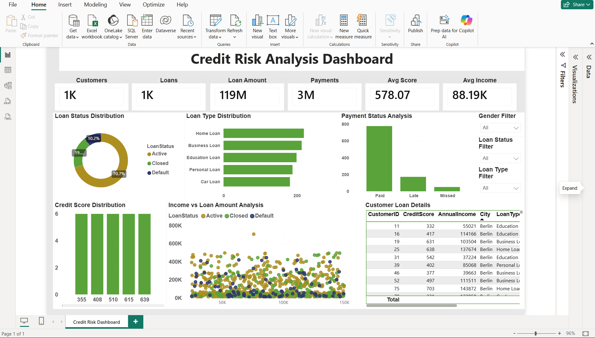

# Credit Risk Analysis

## Projektübersicht

Dieses Projekt zeigt eine End-to-End-Lösung zur Analyse von Kreditrisiken mit **SQL Server** und **Power BI**. Kunden-, Kredit- und Zahlungsdaten wurden in SQL Server importiert, mit SQL analysiert und anschließend in einem interaktiven Power BI-Dashboard visualisiert.

---

## Verwendete Technologien

- SQL Server Management Studio (SSMS)
- SQL
- Power BI Desktop
- GitHub

---

## Datensatz

Das Projekt verwendet die folgenden CSV-Dateien:

- customers.csv
- loans.csv
- payments.csv

---

## Datenbanktabellen

- Customers
- Loans
- Payments

---

## SQL-Aufgaben

- Erstellung der Datenbank **CreditRiskDB**
- Erstellung der Tabellen **Customers**, **Loans** und **Payments**
- Import der CSV-Dateien mit dem **SSMS Import Flat File Wizard**
- Überprüfung der importierten Daten
- Durchführung von SQL-Analysen mit:
  - JOIN-Abfragen
  - Aggregatfunktionen (SUM, COUNT, AVG)
  - CASE-Anweisungen
  - KPI- und Geschäftsanalysen

---

## Power BI Dashboard

Das Dashboard enthält:

- Gesamtzahl der Kunden
- Gesamtzahl der Kredite
- Gesamte Kreditsumme
- Gesamtbetrag der Zahlungen
- Durchschnittlicher Kredit-Score
- Durchschnittliches Jahreseinkommen
- Analyse des Kreditstatus
- Analyse der Kreditarten
- Analyse des Zahlungsstatus
- Verteilung der Kredit-Scores
- Analyse von Einkommen und Kredithöhe
- Kundendetails
- Interaktive Filter (Slicer)

---

## Projektstruktur

```text
Credit-Risk-Analysis
│
├── data
│   ├── customers.csv
│   ├── loans.csv
│   └── payments.csv
│
├── sql
│   ├── 01_Create_Database.sql
│   ├── 02_Create_Tables.sql
│   ├── 03_Import_Data.sql
│   └── 04_Credit_Risk_Analysis_Queries.sql
│
├── powerbi
│   └── Credit_Risk_Analysis_Dashboard.pbix
│
├── images
│   ├── credit_risk_dashboard.png
│   └── data_model.png
│
└── README.md
```

---

## Dashboard-Vorschau

### Credit Risk Analysis Dashboard



---

## Nachgewiesene Fähigkeiten

- Datenbankdesign mit SQL Server
- Datenimport und Datenvalidierung
- SQL-Abfragen und Datenanalyse
- Datenmodellierung
- Entwicklung interaktiver Power BI-Dashboards
- KPI-Berichterstellung
- Datenvisualisierung

---

## Autor

**Anitha Doddavula**
